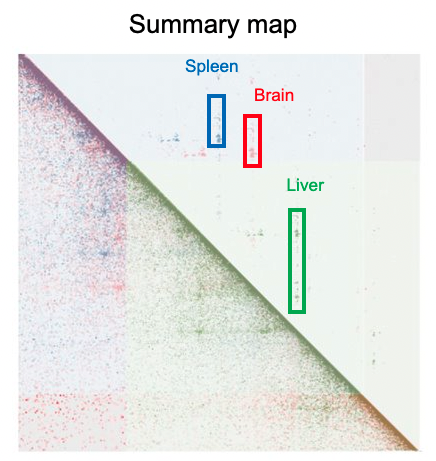
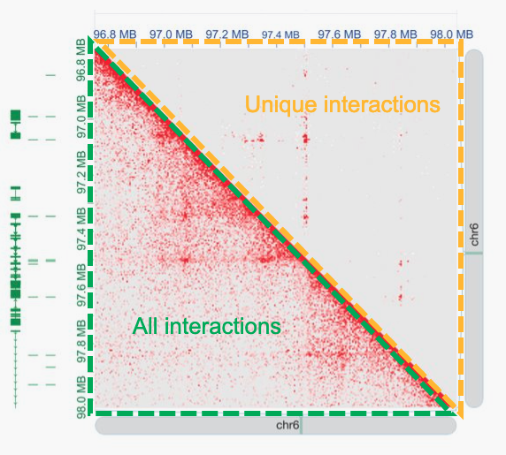
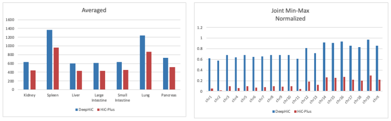

# HiC-ECC (Enhance, Compare, and Call) Pipeline
## Motivation

The Hi-C technology is a powerful genomic analysis technique tool for studying 3D genome organization. However, due to sequencing cost, the resolution of Hi-C datasets is often coarse. Many effective tools exist to computationally enhance the resolution of these Hi-C datasets. 

Changes in the 3D organization of chromatin are associated with central biological processes, such as transcription, replication and development. Furthermore, differences between Hi-C samples taken from different cell types or phases, or between healthy and cancerous cells, yield varying structural features and biological implications. Therefore, the comprehensive quantification of these differences and the identification of specific genome structures is fundamental to the understanding of biological mechanisms and to the development of therapeutical treatments. Many tools also exist to computationally compare and identify structures in Hi-C datasets. 

Despite the rising availability of these individual tools, there is an increasing need to streamline these various tools into a single analytical pipeline. Even more so, this pipeline should be made up of the best performing methods, determined through unbiased comparative analysis. Such a pipeline would greatly improve the quality and ease of analysis in Hi-C experiments. 

## Methods and Tools
### HiC Pre-processing 
- **HiC-Pro** - https://github.com/nservant/HiC-Pro \
HiC-Pro is an optimized and flexible pipeline for Hi-C data processing. Raw .fastq files from HiC experiments are inputted, and .matrix interaction maps/matrices are outputted.

HiC-Pro 
### Enhancing Interaction Maps
- **DeepHiC** - https://github.com/Jakob-Zerbs/DeepHiC/tree/dev \
DeepHiC is a deep learning model developed for boosting the resolution of Hi-C data. It is based on Generative Adversarial Network. It takes low-resolution data as conditional inputs for Generator Net in GAN and outputs the enhanced Hi-C matrices.
  
- **HiCplus** - https://github.com/Jakob-Zerbs/hicplus \
A computational approach based on a deep convolutional neural network, to infer high-resolution Hi-C interaction matrices from low-resolution Hi-C data.

- **DeepLoop** - https://github.com/Jakob-Zerbs/DeepLoop \
DeepLoop handles systematic biases and random noises separately: HiCorr improves the rigor of bias correction, and  deep-learning techniques are applied for noise reduction and loop signal enhancement. 

### Comparing Interaction Maps
- **CHESS** - https://github.com/Jakob-Zerbs/chess \
An algorithm for the comparison of chromatin contact maps and automatic differential feature extraction using the SSIM score.

- **multiHiCcompare** - https://github.com/Jakob-Zerbs/multiHiCcompare \
multiHiCcompare provides functions for the joint normalization and comparison of complex Hi-C experiments.

### Calling Structures
- **TADbit** - https://github.com/Jakob-Zerbs/TADbit \
TADbit is a Python library with capabilities to map FASTsQ files to obtain raw interaction binned matrices (Hi-C like matrices), normalize and correct interaction matrices, and identify and compare the Topologically Associating Domains (TADs).

- **NeoLoopFinder** - https://github.com/Jakob-Zerbs/NeoLoopFinder \
NeoLoopFinder is a computational framework that identifies the chromatin interactions induced by SVs, such as inter-chromosomal translocations, large deletions, and inversions. 

### Visualization Tools
- https://github.com/vaquerizaslab/fanc
- https://github.com/akdemirlab/HiCPlotter
  
## Results
The HiC enhance and compare pipeline was tested on the following mm10 tissue samples:
- Heart
- Kidney
- Spleen
- Liver
- Large Intestine
- Small Intestine
- Lung
- Pancreas

### Enhancing Interaction Maps 
Comparative analysis proved that DeepHiC is a more effective interaction map enhancer. As seen in the figure below, DeepHiC increases the number of interactions across all chromosomes by a greater extent than HiCPlus.  

