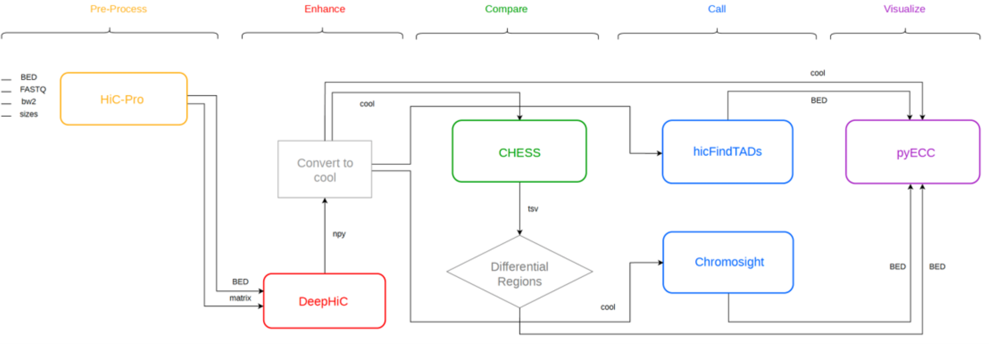
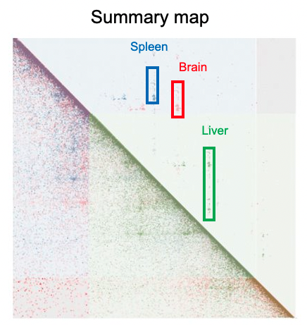
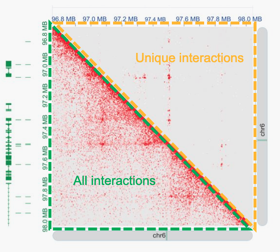
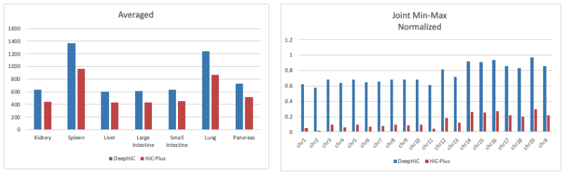

# HiC-ECC: Hi-C Enhancement, Comparison, and Calling Pipeline






## Overview

HiC-ECC is an end-to-end pipeline for Hi-C data analysis, integrating resolution enhancement, pairwise comparison, and structure calling into a single config-driven workflow. It is designed to be accessible to biologists with minimal computational experience, while remaining flexible for advanced users.

The pipeline consists of three modules:
1. **Enhance** — Improve Hi-C resolution using deep learning (DeepHiC)
2. **Compare** — Pairwise comparison of chromatin contact maps and unique region extraction (CHESS)
3. **Call** — Loop and TAD calling on enhanced maps (Chromosight, hicFindTADs)

## Installation

```bash
# Clone the repository
git clone https://github.com/your-org/HiC-ECC.git
cd HiC-ECC

# Create and activate the conda environment
conda env create -f environment.yml
conda activate hic
```

## Quick Start

1. Edit `config/config.yaml` with your paths and samples
2. Run the full pipeline:

```bash
python run.py --config config/config.yaml --module all
```

Or run individual modules:

```bash
python run.py --config config/config.yaml --module enhance
python run.py --config config/config.yaml --module compare
python run.py --config config/config.yaml --module call
```

For SLURM clusters, parallelize the compare module across tissues:

```bash
for i in {0..7}; do sbatch submit_compare.sh $i; done
```

## Repository Structure

```
HiC-ECC/
├── src/                  # Core Python modules
│   ├── enhance.py
│   ├── compare.py
│   └── call.py
├── notebooks/
│   └── tutorials/        # Step-by-step Jupyter notebooks
│       ├── enhance.ipynb
│       ├── compare.ipynb
│       ├── call.ipynb
│       └── visualize.ipynb
├── config/
│   └── config.yaml       # All pipeline parameters
├── data_example/         # Small example dataset for testing
├── results_example/      # Expected outputs
├── figures/              # Pipeline figures
├── run.py                # CLI entry point
└── environment.yml       # Conda environment
```

## Configuration

All parameters are set in `config/config.yaml`. Key fields:

```yaml
samples:
  - Brain
  - Kidney

genome: mm10
resolution: 10000
hicpro_dir: /path/to/hicpro_output
output_dir: /path/to/output

enhancement:
  method: deephic
  checkpoint: /path/to/deephic_raw_16.pth

comparison:
  window: 310000
  step: 10000

calling:
  loops:
    tool: chromosight
  tad:
    tool: hicFindTADs
```

## Dependencies (conda env: hic, Python 3.9)

- cooler
- cooltools
- pairtools
- chess-hic
- fithic
- tadbit
- cooler-ontad
- coolpuppy
- hicrep
- hic-straw
- hicexplorer
- PyTorch 2.1.1
- torchvision
- fanc
- matplotlib
- seaborn
- plotly
- tadtool
- bedtools
- samtools
- deeptools
- macs2
- pybedtools
- pybigwig
- bioframe
- numpy
- scipy
- pandas
- scikit-learn
- numba
- dask

Full environment: `environment.yml`

## Methods and Tools

### Pre-processing
- **HiC-Pro** — https://github.com/nservant/HiC-Pro

### Enhancement
- **DeepHiC** — https://github.com/Jakob-Zerbs/DeepHiC/tree/dev
- **HiCplus** — https://github.com/Jakob-Zerbs/hicplus
- **DeepLoop** — https://github.com/Jakob-Zerbs/DeepLoop

### Comparison
- **CHESS** — https://github.com/Jakob-Zerbs/chess

### Calling
- **hicFindTADs** — https://github.com/deeptools/HiCExplorer
- **Chromosight** — https://github.com/koszullab/chromosight

### Visualization
- **FAN-C** — https://github.com/vaquerizaslab/fanc
- **HiCPlotter** — https://github.com/akdemirlab/HiCPlotter

## Tested Samples

Pipeline validated on mm10 mouse tissues: Kidney, Spleen, Liver, Large Intestine, Small Intestine, Lung, Pancreas, Brain.
